# Description

In this project, I'll create an AI agent in AI Foundry.

# Steps

Go to AI Foundry and create an AI hub

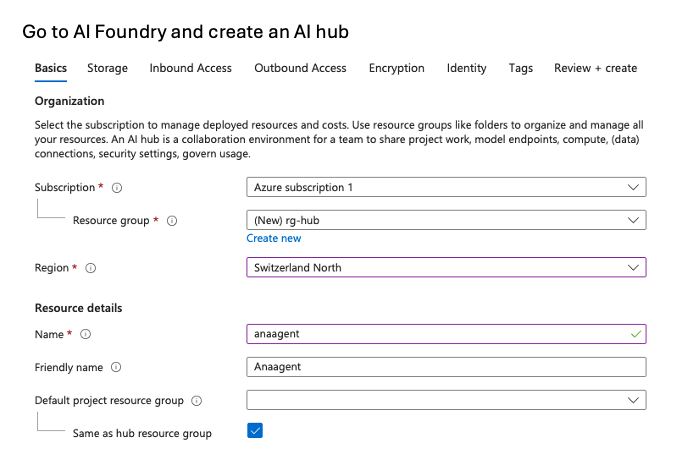

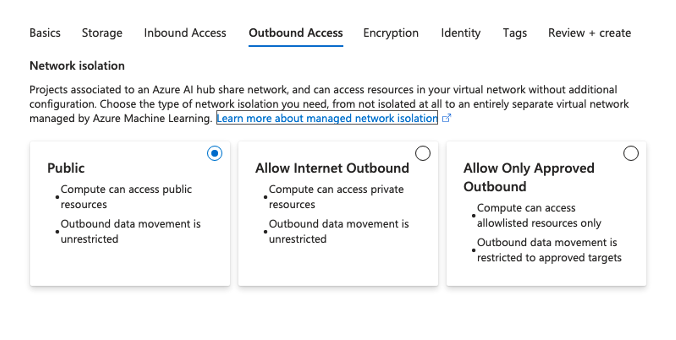

The rest as default

The resource is created:

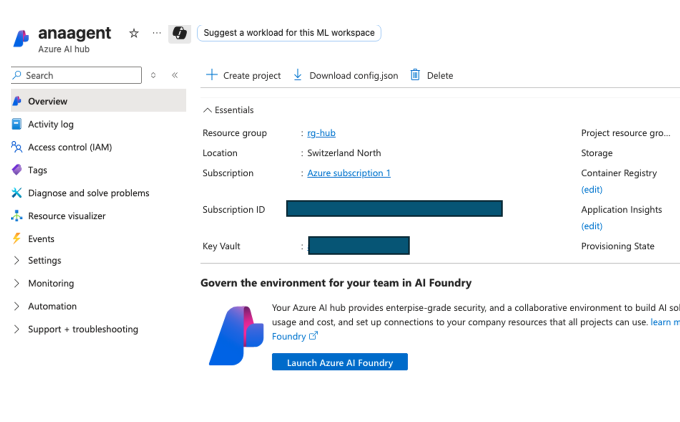

Click Launch Azure AI Foundry and new project:

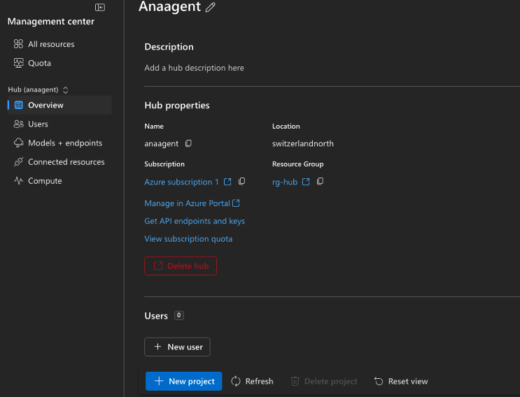

Deploy a model

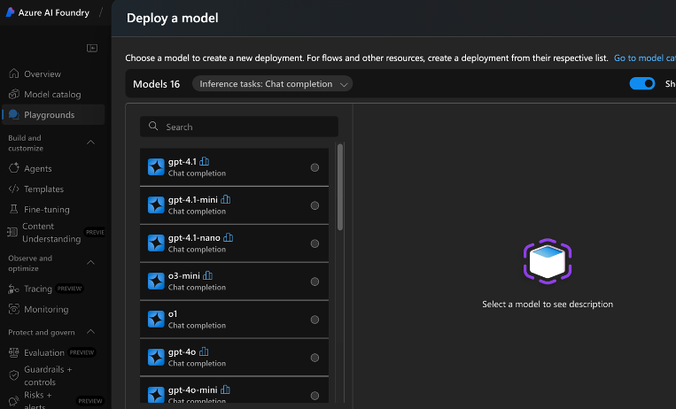

I'll choose gpt-4.1

Our first agent is created:

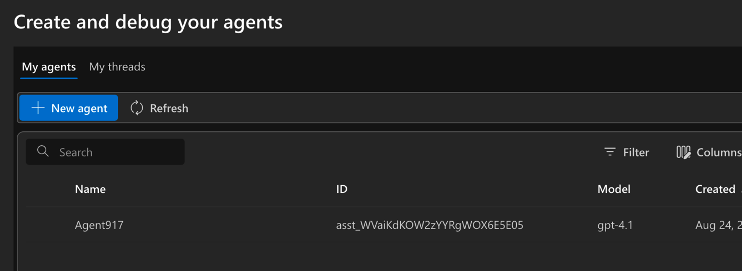

we give the agent some instructions:

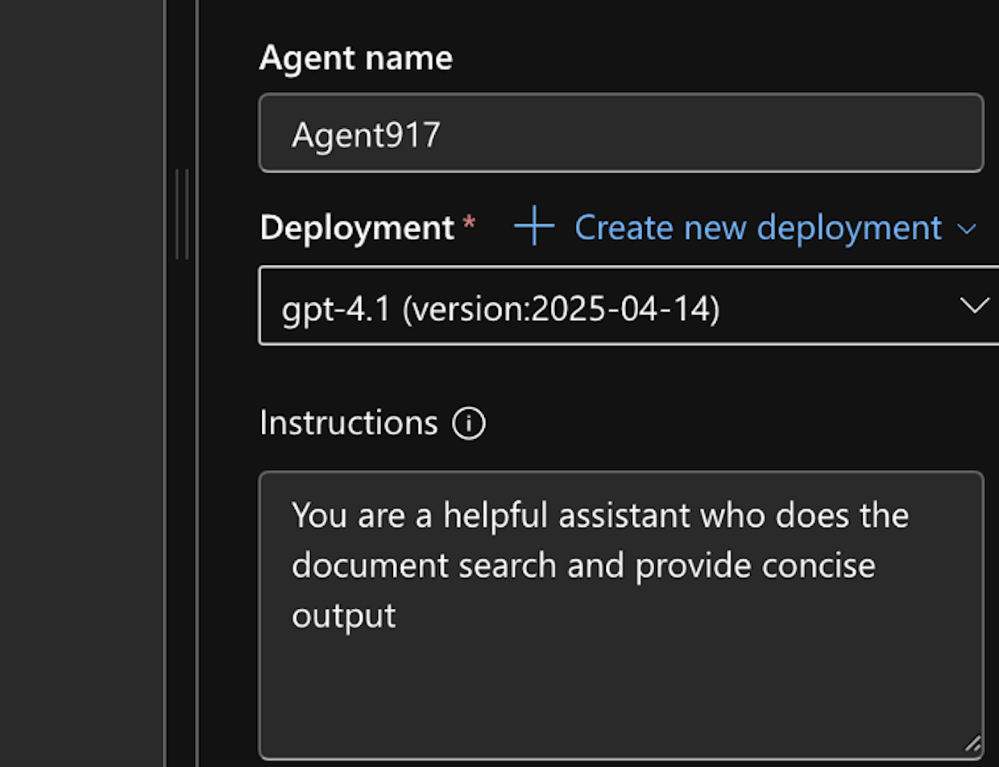

and we add a document about Employee Handbook

# Results

Let’s ask about this section of the Employee Handbook in the playground:

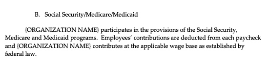

Here’s the answer:

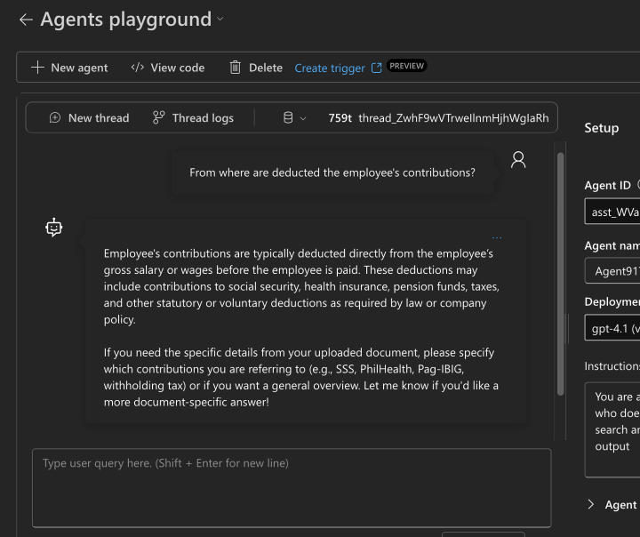

We’ll create a new agent:

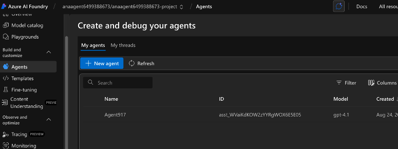

Go to code interpreter action:

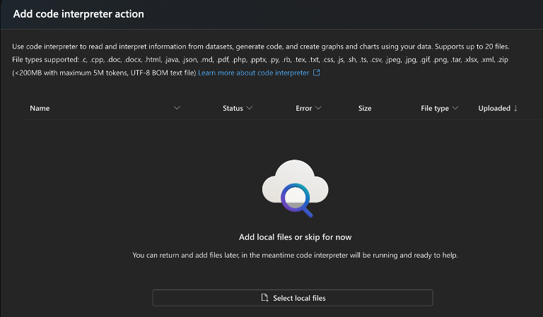

Upload an Excel about order supplies:

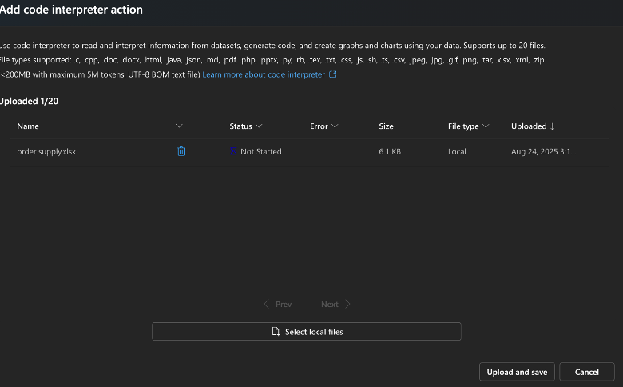

Go to playground and ask as question to the agent:

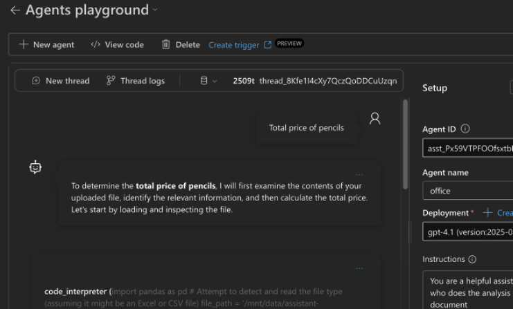

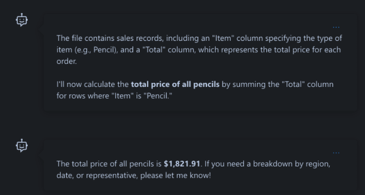

and the answer is pretty good!
